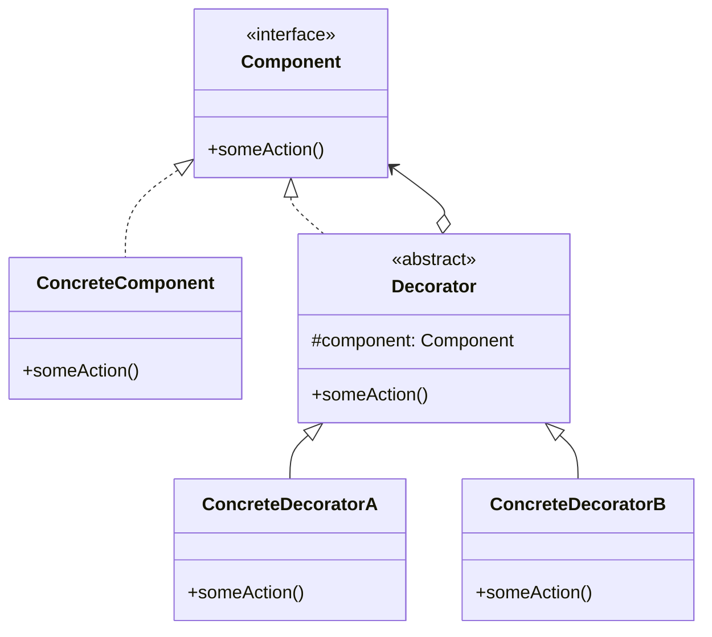

# 对 Java 属性的一些解读

所有学过 Java 的人一定对 `setXxx` 和 `getXxx` 形式的方法不陌生，这是 Java 中对访问字段的封装，其中的 `Xxx` 部分被称为**属性**。本文面向 Java 初学者，解读 Java 属性这样设计的意义。

::: tip
本文的内容实际上是我在用 GameMaker 写代码时遇到的问题，由于 GameMaker Language 的 OO 特性刚刚实装，没有什么使用 getter 和 setter 的惯例，使得后期修改代码时遇到很大问题，所以才记录一下。
:::

## Java 中的属性

以下是一个使用属性例子：
```java
class Person {
    private String name;
    private Integer age;

    public String getName() { return name; }

    public void setName(String name) { this.name = name; }

    public Integer getAge() { return age; }

    public void setAge(Integer age) { this.age = age; }
}
```
初学者经常会有这样的疑问：为什么要写那么多只有一句话的方法，不能直接用公共字段吗？我们知道，使用方法代替字段的一个好处是可以对输入做检查，例如：
```java
public void setAge(Integer age) {
    if (age < 0) {
        throw new IllegalArgumentException("Age should be non-negative.");
    }
    this.age = age;
}
```
但有很多数据并不需要做输入检查，看上去 `setXxx` 显得非常多余。

其中一种解释是：比起字段，方法可以被重写。如果子类的属性的数据源发生了变化，那么重写 getter 就能修改数据源，我们在后面的装饰器模式中会见到类似的用法。

另一种解释是统一接口。我们知道接口中只能定义方法，在面向接口编程时[^面向接口编程]，如果我们需要指明某种接口都有的属性，就只能用方法的方式定义。另一方面，即使眼下一些属性不需要做额外的安全检查，但也难保今后都不会添加。举个例子，如果哪一天想监视某个属性值的变化，对于 `setXxx` 的形式，只需要在方法中添加 log 输出即可，无需修改其他代码。使用字段则需要把字段访问重新修改成 `setXxx` 的形式。例如：
```java
public void setAge(Integer age) {
    System.out.printf("Age is updated: %d\n", age);
    this.age = age;
}
```
外部接口统一使用 getter 和 setter 可以尽可能避免未来对代码的改动。

[^面向接口编程]: 指暴露给使用者的 API 中尽可能使用接口类型而不是具体类型，这样一方面确保只有必要的 API 暴露出去，防止意外调用不需要的功能，另一方面也方便 API 的维护者进行优化：他可以使用任意的类代替原有的类，只要它们实现了相同的接口。

## 装饰器模式

为了更直观感受 getter 和 setter 的使用场景，我们介绍以下设计模式中的装饰器模式，已经学过的读者可以直接跳过。

我们先来看看 Java 标准库中是怎么使用装饰器模式的。当我们要写入文件时，可以用 `FileOutputStream`：
```java
public static void writeFile(String filename) throws IOException {
    try (FileOutputStream fos = new FileOutputStream(filename)) {
        fos.write(48);
    } catch (IOException e) {
        e.printStackTrace();
    }
}
```
`FileOutpuStream` 是一个最基本的文件输出流，它以字节的形式写入文件，如果你需要读写的数据是二进制数据，那么这个输出流可以胜任一部分工作。这里写入了字节 48，如果以文本形式打开文件，会显示 `0`，因为 48 是 `0` 的 ASCII 码。

当我们想写入字符串时，以字节形式写入文件显然过于繁琐（我们当然可以用 `FileWriter` 之类的类实现，但其底层都使用 `FileOutputStream`，这里为了展示装饰器模式不使用）。我们可能想要一个和 `System.out` 一样的对象，可以使用 `println`、`printf` 之类的功能输出字符串。此时我们可以使用 `PrintStream`：
```java
public static void writeFile(String filename) throws IOException {
    try (FileOutputStream fos = new FileOutputStream(filename)) {
        PrintStream ps = new PrintStream(fos);
        ps.printf("%d + %d = %d", 1, 2, 3);
    } catch (IOException e) {
        e.printStackTrace();
    }
}
```
这里我们把 `PrintStream` 套在 `FileOutpuStream` 之外，扩展了 `FileOuputStream` 的功能，添加了 `printf` 等其他函数。`ps.write(48)` 依然会写入字符 `0`，这个功能仍然是交给 `fos` 执行的，但 `printf` 则是对输入的参数做了其他处理，转换成字节之后再交给 `fos` 执行的。我们可以写出这样的伪代码：
```java
public class PrintStream {
    private FileOutputStream fos;

    public PrintStream(FileOutputStream fos) {
        this.fos = fos;
    }

    public PrintStream write(int b) {
        fos.write(b);
        return this;
    }

    public PrintStream printf(...) {
        // 将 printf 的输入转换成字节
        int[] bytes = processInput(...);
        fos.write(bytes);
        return this;
    }
}
```
装饰器模式的本质是将某个已有的类包装在另一个**装饰类**的内部，从而在不修改原有类的基础上添加新的功能或修改已有功能。对于不需要重写的方法（例如上述方法 `write`）可以直接**委托**给内部实例实现。

装饰器模式的一般模式可以用 UML 类图表示为（Mermaid 对分支线没有精细的控制参数，凑合看看吧）：

如果你没有学过类图，可以看看下面的伪代码：
```java
// 被装饰类和装饰类的公共接口
public interface Component {
    void someAction();
}

// 具体的被装饰类
public class ConcreteComponent implements Component {
    @Override
    public void someAction() {
        doSomething();
    }
}

// 装饰类基类
public abstract class Decorator implements Component {
    protected Component component;

    public Decorator(Component component) {
        this.component = component;
    }
}

// 具体的装饰类
public class ConcreteDecoratorA extends Decorator {
    public ConcreteDecoratorA(Component component) {
        super(component);
    }

    @Override
    public void someAction() {
        // 委托给原实例执行
        component.someAction()
    }

    // 扩展的方法
    public void anotherAction() {
        doSomething();
    }
}

// 具体的装饰类
public class ConcreteDecoratorB extends Decorator {
    public ConcreteDecoratorB(Component component) {
        super(component);
    }

    @Override
    public void someAction() {
        // 自己另外实现
        doSomething();
    }
}
```
`Decorator` 类是否是抽象类/基类取决于具体情况，你也可以只有唯一的装饰类。

在之前的写文件示例中，`Component` 可能是类似 `Closeable` 的接口，`ConcreteComponent` 可以是 `FileOutputStream`，`Decorator` 则可以是 `PrintStream`。

聪明的读者可能已经发现了答案：在装饰器模式中必须通过重写 getter/setter 才能将装饰类的属性委托给被装饰类。我们举一个例子说明问题。

## 状态机/决策模式结合装饰器模式

这里并不打算详细解释状态机模式和决策模式，只给出一个案例。

假设你在写游戏，现在要编写一系列预定的动作，我们会设计出这样的接口：
```java
public interface Behaviour {
    // State 属性，0 = 未开始，1 = 执行中，2 = 执行结束
    default int getState();
    default void setState(int state);
    // 动作开始时的准备工作
    default void onStart() {}
    // 动作结束后的收尾工作
    default void onFinish() {}
    // 动作更新（会频繁调用）
    default void onUpdate() {}
}
```
所有实现了这个接口的动作，都会在开始时调用 `onStart()`，然后频繁执行 `onUpdate()` 来更新游戏内容，当动作执行结束时调用 `onFinish()`。

现在我们编写一个具体的动作：让某个物体移动一小段距离。伪代码如下所示：
```java
public class TranslateBehaviour implements Behaviour {
    private Vector2 velocity;
    private int state = 0;

    @Override
    public int getState() { return state; }

    @Override
    public void setState(int state) { this.state = state; }

    @Override
    public void onStart() {
        velocity = ...;
        setState(1);
    }

    @Override
    public void onUpdate() {
        if (getState() == 1) {
            // 让物体移动一小段距离
            moveSomeDistance(velocity);
            if (到达指定地点) {
                onFinish();
                setState(2);
            } 
        }
    }
}
```
要让动作开始只需要执行 `onStart()` 即可。

假设我们有一个函数 `wait(sec)` 可以让代码延迟 `sec` 秒执行（类似 `sleep`，实际可能会用回调或者协程实现，这里只是示意一下）。现在想让这个移动行为被触发后延迟 1 秒执行，一种想法是直接继承之：
```java
public class DelayedTranslateBehaviour extends TranslateBehaviour {
    @Override
    public void onStart() {
        wait(1);
        super.onStart();
    }
}
```
但如果我们有很多种可能的行为，都使用继承编写 `DelayedXxxx` 的话会非常繁琐。根据实际情况，我们可能只需要其中一部分延迟执行，此时使用装饰器模式（也是一种组合模式）会更好。

我们编写一个装饰类：
```java
public class DelayedBehaviour implements Behaviour {
    private Behaviour behaviour;
    private int time;

    public DelayedBehaviour(Behaviour behaviour, int time) {
        this.behaviour = behaviour;
        this.time = time;
    }

    @Override
    public void onStart() {
        wait(time);
        behaviour.onStart();
    }

    @Override
    public void onFinish() {
        behaviour.onFinish();
    }

    @Override
    public void onUpdate() {
        behaviour.onUpdate();
    }
}
```
这样，我们可以使用如下代码实现延时执行：
```java
Behaviour delayedTranslateBehaviour = new DelayedBehaviour(
    new TranslateBehaviour(),
    1
);
delayedTranslateBehaviour.onStart();
```
但实际上这段代码是无法编译的，因为我们没有实现 `getState` 和 `setState`。考虑一下，`DelayedBehaviour` 的状态是完全取决于其内部被装饰的实例的，因此我们需要重写该属性，将数据源转移到被装饰的实例上：
```java
public class DelayedBehaviour implements Behaviour {
    private Behaviour behaviour;

    @Override
    public int getState() {
        return behaviour.getState();
    }

    @Override
    public void setState(int state) {
        behaviour.setState(state);
    }

    ...
}
```
如果使用字段 `state`，那么我们将无法实现重写，`DelayedBehaviour` 的状态就不能随被装饰的 `behaviour` 实时获取。

## C# 中的属性

Java 这种将属性写成方法的设计虽然有助于后期维护，但在编写属性时需要大量重复工作，在使用属性时也没有整数等内置类型那样方便。C# 的语法和 Java 极为相似，但它却很早实现了属性的语法糖，例如：
```cs
public class Person {
    private int age;

    public int Age {
        get { return age; }
        // value 关键字在属性的 set 方法中表示输入数据
        set {
            if (value < 0) {
                throw new ArgumentException("Age should be non-negative.");
            }
            age = value;
        }
    }
}

Person person;
person.Age = 2; // 调用 Age 的 set 方法，其中 value 为 2
Console.WriteLine(person.Age); // 调用 Age 的 get 方法
person.Age += 5; // 同时调用了 get 和 set，因为这是 person.Age = person.Age + 5 的语法糖
```
其中的 `get` 和 `set` 方法可以省略任意一个。

如果一个属性不需要额外操作，就如同使用字段那样使用属性，则可以省略方法体：
```cs
public class Person {
    public String Name { get; set; }
}
```
这样就不必显式定义私有字段了。

## Kotlin 中的属性

Kotlin 的属性和 C# 很相似：
```kotlin
class Person {
    private var _age: Int = 0

    var name: String get set
    var age: Int
        get() = _age
        set(value) {
            if (value < 0) { ... }
            _age = value
        }
}
```
事实上我们还能免去声明私有字段的功夫，用 `field` 表示内部自动创建的私有字段：
```kotlin
class Person {
    var name: String get set
    var age: Int
        get
        set(value) {
            if (value < 0) { ... }
            field = value
        }
}
```
Kotlin 属性使用起来和普通字段没有区别：
```kotlin
val person = Person()
val ageOfPerson = person.age
person.age += 5
```

## Kotlin 中的委托

在写装饰类时我们可能遇到一个问题：如果我们只需要重写部分功能，而其他功能沿用被包装的实例，那么我们需要编写很多冗余的代码：
```java
public class DelayedBehaviour implements Behaviour {
    private Behaviour behaviour;
    private int time;

    public DelayedBehaviour(Behaviour behaviour, int time) {
        this.behaviour = behaviour;
        this.time = time;
    }

    @Override
    public void onStart() {
        wait(time);
        behaviour.onStart();
    }

    // onFinish 和 onUpdate 的重写显得很冗余，它们都是相同的模式
    @Override
    public void onFinish() {
        behaviour.onFinish();
    }

    @Override
    public void onUpdate() {
        behaviour.onUpdate();
    }
}
```
Kotlin 的委托可以自动实现这一步骤：
```kotlin
class DelayedBehaviour(private val behaviour: Behaviour, val time: Int)
: Behaviour by behaviour {
    override fun onStart() {
        wait(time)
        behaviour.onStart()
    }
}
```
这里 `: Behaviour` 表示实现接口 `Behaviour`，而 `by behaviour` 这里的 `behaviour` 是构造函数传递进来的参数，`by behaviour` 表示将当前类的实例方法委托给 `behaviour`，意思就是所有 `Behaviour` 接口中的方法通过调用 `behaviour` 实现，因此上述代码的功能是一样的，如果写完整则是：
```kotlin
class DelayedBehaviour(private val behaviour: Behaviour, val time: Int): Behaviour
    override fun onStart() {
        wait(time)
        return behaviour.onStart()
    }

    override fun onFinish() = behaviour.onFinish()

    override fun onUpdate() = behaviour.onUpdate()
}
```
由于 Kotlin 中的 `void` 由 `Unit` 替代，而 `Unit` 也是有实例的数据类型，因此我们可以 `return Unit`，从而将所有有返回值和无返回的情形统一返回，比 Java 处理重写的机制更优雅。 